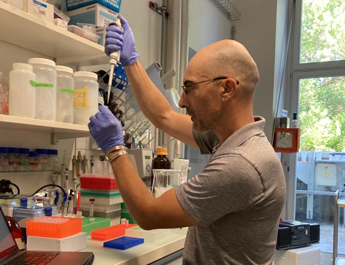

Hello and welcome to my homepage. I'm an amphibian biologist based in northeastern France. Right now I work as a freelance researcher. I'm specialised in genetics and ecology statistics. Throughout the years, I worked on various topics such as species diversification, biogeography, systematics, as well as conservation biology through population genetics and wildlife monitoring.

:::{layout-ncol=2}

:::

