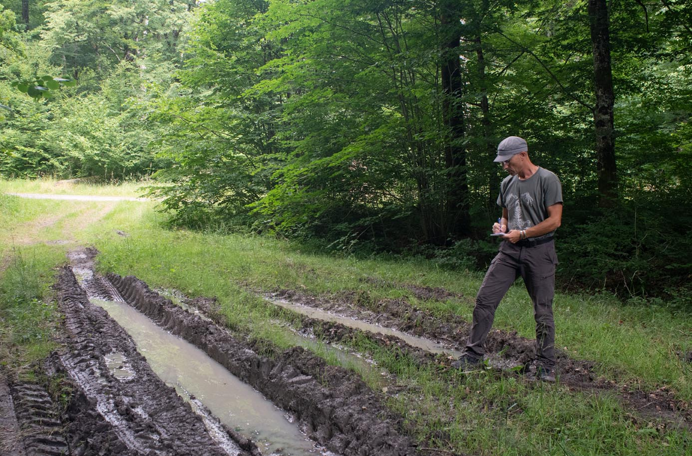

Hello and welcome to my homepage. I'm an amphibian biologist based in northeastern France. I work as a scientific officer at [HYLA](https://hyla-asso.github.io/), and also I'm an associated senior lecturer at [university of Strasbourg](https://live.unistra.fr/). I'm specialised in genetics and ecology statistics. During my PhD, I worked on evolution of Neotropical frogs under the supervision of [Antoine Fouquet](https://antoinefouquet.wordpress.com/) and [Christophe Thébaud](https://thebaud.weebly.com/). Now I focus on amphibians in northeastern France and neighbouring regions.

Throughout the years, I worked on various topics such as species diversification, biogeography, systematics, as well as conservation biology through population genetics and wildlife monitoring.

My current research projects encompass two main topics:

- How species at the edge of their range face global changes. For this, I explore spatial dynamics as well as variation of genetic diversity in populations of amphibians with contrasted natural history, i.e. edge vs. core of distribution, and natural vs. artificial habitats. Amphibians are rather good models for this question as they are very sensitive to climatic stressors, and most of them have poor dispersal capacities. As I live in a region with species at the limit of their range, and others at the core of their distribution, I don't have to go far to collect field data!

Keywords: climate change. Adaptation. Spatial ecology. Genetic diversity. Amphibians.

- Understanding spatial dynamics of introduced populations and their interaction with native species. I work on the fire-bellied toad, a newcomer in northeastern France. I model the spatial and temporal dynamics of its distribution, explore interaction with native species through comparison of trophic niche and genetic introgression with the native yellow-bellied toad.

Keywords: Invasion biology. Hybridization. Dynamic occupancy models. Amphibians.

:::{layout-ncol=2}

Field work: monitoring yellow-bellied toad

Lab work: preparing PCR of amphibian barcoding

:::

